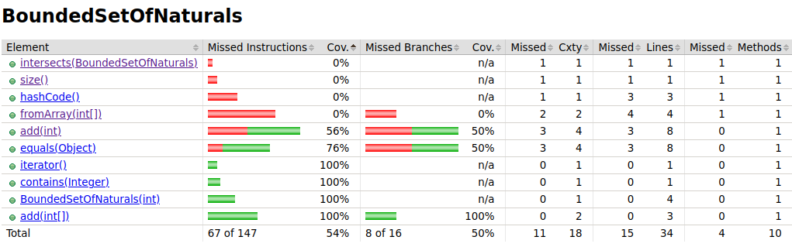

### Author
Miguel Belchior Figueiredo - 108287

---

### Lab 1
#### 2.c)
- [Jacoco analysis](https://www.baeldung.com/jacoco)
- **Assess the coverage level in project “Euromillions-play”.** -  As classes que oferecem menos coverage são as seguintes (por ordem crescente de coverage):
  1. DemoMain - não foram feitos testes para esta classe;
  2. CuponEuromillions  - nesta classe os métodos **countDips()** e **format** não são covered pelos testes existentes, resultando em uma cobertura de 0% nestes métodos o que baixa a coverage da classe. 
  3. BoundedSetOfNaturals - nesta classe os métodos menos cobertos são **fromArray(int[])**, **hashcode()**, **size()** e **intersects()** com uma cobertura de 0% e **add(int)** com uma cobertura de instruções de 56% (número de instruções cobertas / número total de instruções). Neste último método, existe uma cobertura de branches de 50% visto que nos testes não aparecem casos em que as expressões boleanas das if statements presentes sejam verdadeiras. Na sequência deste raciocínio, para haver proper validation da classe BoundedSetOfNaturals serão implementados testes em que a coleção interna por detrás do objeto tenha atingido o limite máximo **(this.collection.size() >= maxSize)**, já tenha o valor que se pretende adicionar **(this.collection.contains(element))** e em que o elemento não seja um número natural **(element <= 0)** o que não é admissível no euromilhões nem para os números nem para as estrelas.
     
      
       

#### 2.d) 

- Todos os métodos previamente mencionados têm agora uma coverage de 100%.
- É de focar que a coverage de uma classe não tem de ser sempre 100% não fazendo sentido fazer testes para métodos equals e hashcode que normalmente até são gerados **(observação do professor na aula prática)**  