## ANSWERS
### 6.1.e) Has your project passed the defined quality gate?
- Yes. It passed the quality gate because it checks for the quality of the new code (default: clean as you code). Because of this default the initial baseline passes the quality gate despite not complying fully with its demands. According to the default quality gate "Sonar Way" new code will be clean if:
  - **New code has 0 issues** - It has 18 issues
  - **All new security hotspots are reviewed** - There is one not reviewed security hotspot
  - **New code is sufficiently covered by test (Coverage is greather than or equal to  80.0%)** - coverage is 75%
  - **New code has limited duplication(Duplicated Lines (%) is less than or equal to  3.0%)** - With 0.0% duplication this is the only parameter met. 
### 6.1.f) Explore the analysis results and complete with a few sample issues, as applicable.

<table>
<tr>
<th align="center">

<p> 
<small>
Problem Description
</small>
</p>
</th>
<th align="center">

<p> 
<small>
How to Solve
</small>
</p>
</th>
</tr>

<tr>
<td>

``Bug``

There are no bugs.
</td>
<td>
There are no bugs.
</td>
</tr>

<tr>
<td>

``Vulnerability``

There are no vulnerabilities.
</td>
<td>
There are no vulnerabilities.
</td>
</tr>

<tr>
<td>

``Code smell (major)`` 

**Invoke method(s) only conditionally.**

Some method calls can effectively be "no-ops", **meaning that the invoked method does nothing, based on the application’s configuration (eg: debug logs in production). However, even if the method effectively does nothing, its arguments may still need to evaluated before the method is called. Similarly, passing concatenated strings into a logging method can also incur a needless performance hit because the concatenation will be performed every time the method is called, whether or not the log level is low enough to show the message.** Instead, you should structure your code to pass static or pre-computed values into Preconditions conditions check and logging calls. Specifically, the built-in string formatting should be used instead of string concatenation, and if the message is the result of a method call, then Preconditions should be skipped altogether, and the relevant exception should be conditionally thrown instead. **TLDR: In this case, string format is performed regardless of the log level**

</td>
<td>

**Old Code:** 
```java
log.info("Betting with three random bets \n{} ", myBet.format());
```
**New Code:** 
```java
if (log.isInfoEnabled())
    log.info("Betting with three random bets \n{} ", myBet.format());
// this is compliant, because it will not evaluate if log level is above info.
```

</td>
</tr>

<tr>
<td>

``Code smell (major)``

**Remove this unused import 'java.security.NoSuchAlgorithmException'.**

Unnecessary imports refer to importing types that are not used or referenced anywhere in the code.

</td>
<td>

**Old Code:**
```java
import java.security.NoSuchAlgorithmException;
```

**New Code:** Just remove the line :)

</td>
</tr>

<tr>
<td>

``Code smell (major)``

**Refactor the code in order to not assign to this loop counter from within the loop body.**

A for loop termination condition should test the loop counter against an invariant value that does not change during the execution of the loop. Invariant termination conditions make the program logic easier to understand and maintain.

</td>
<td>

**Old Code:** 
```java
for (int i = 0; i < NUMBERS_REQUIRED; ) {
int candidate = generator.nextInt(NUMBERS_RANGE_MAX) + 1;
    if (!randomDip.getNumbersColl().contains(candidate)) {
        randomDip.getNumbersColl().add(candidate);
        i++;
    }
}
```

**New Code:**
```java
int i = 0;
while (i < NUMBERS_REQUIRED){
int candidate = generator.nextInt(NUMBERS_RANGE_MAX) + 1;
    if (!randomDip.getNumbersColl().contains(candidate)) {
        randomDip.getNumbersColl().add(candidate);
        i++;
    }
}
```


</td>

</tr>
</table>

### 6.2.a) Take note of the technical debt found. Explain what this value means. Document the analysis findings with a screenshot (of the sonar dashboard for this project).
- Technical Debt Found: 22 min. 
- [Technical Debt Definition](https://docs.sonarsource.com/sonarqube/latest/user-guide/metric-definitions/#maintainability): A measure of effort to fix all code smells. Which means that in the previous example sonarqube estimates that one programmer would take 22 minutes to fix all code smells.
- ScreenShot Dashboard

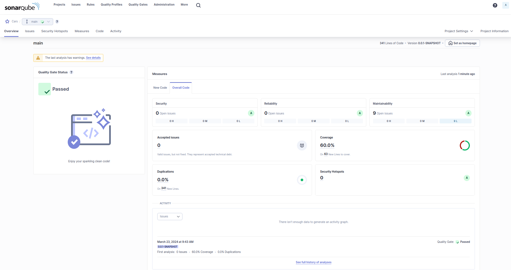
- ScreenShot Issues (with the indication of technical debt)

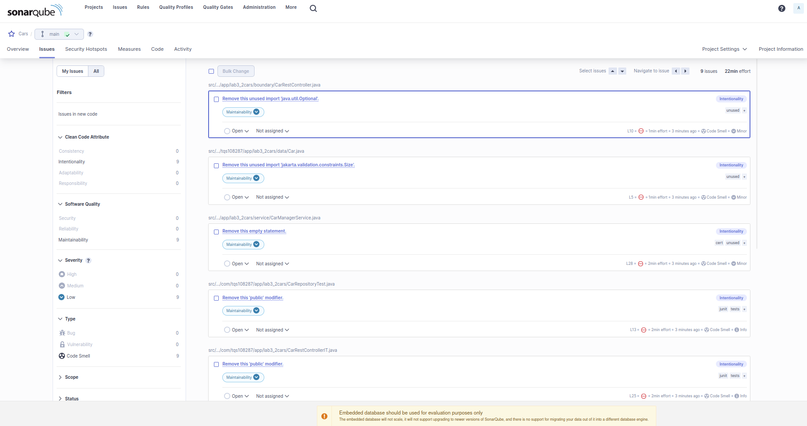

### 6.2.b) Analyze the reported problems and be sure to correct the severe code smells reported (critical and major). Note: if you used the Entity data type as parameter in the API methods, you will likely get the vulnerability “Persistent entities should not be used as arguments”.

- I already had used DTO's as the parameter, so I didn't get the vulnerability “Persistent entities should not be used as arguments”. These were the issues found in the code (9 code smells):
  - Remove this unused import 'java.util.Optional'. (src/.../app/lab3_2cars/boundary/CarRestController.java)
  - Remove this unused import 'jakarta.validation.constraints.Size'. (src/.../tqs108287/app/lab3_2cars/data/Car.java)
  - Remove this empty statement. (src/.../app/lab3_2cars/service/CarManagerService.java)
  - Remove this 'public' modifier. (src/.../com/tqs108287/app/lab3_2cars/CarRepositoryTest.java)
  - Remove this 'public' modifier. (src/.../com/tqs108287/app/lab3_2cars/CarRestControllerIT.java)
  - Remove this 'public' modifier. (src/.../com/tqs108287/app/lab3_2cars/CarRestController_WithMockServiceTest.java)
  - Remove this 'public' modifier. (src/.../com/tqs108287/app/lab3_2cars/CarService_UnitTest.java)
  - Use assertThat(actual).isPresent() instead. (src/.../com/tqs108287/app/lab3_2cars/CarService_UnitTest.java)
  - Use assertThat(actual).isNotPresent() or assertThat(actual).isEmpty() instead. (src/.../com/tqs108287/app/lab3_2cars/CarService_UnitTest.java)
- ScreenShot Issues after fix of code smells

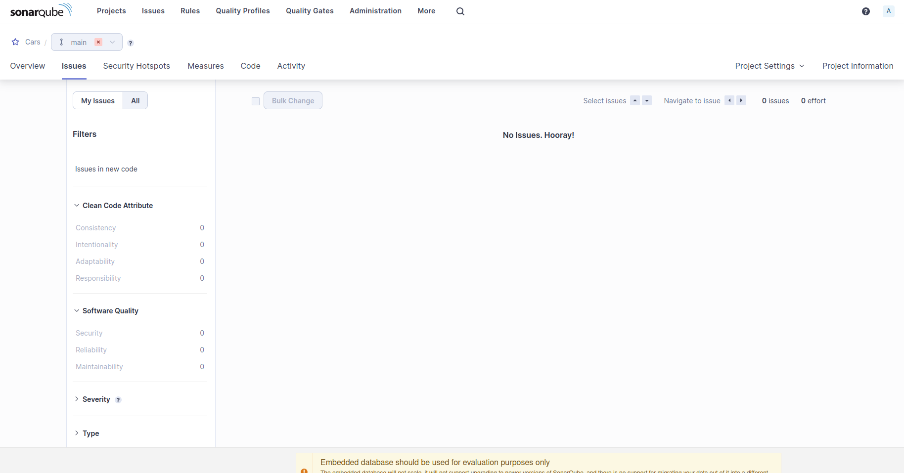

- However, as you can see in the following image the new code (the 4 files I changed to fix the issues) didn't pass the quality gate as coverage on these files is under 80%. Thus, displaying the previously mentioned behaviour as only new code triggered a warning despite in the overall code the coverage also not being equal or above to 80% (as you will se in the next exercise). 

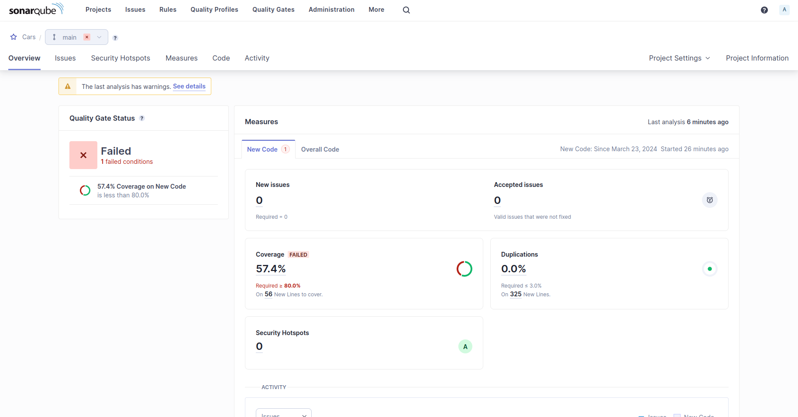
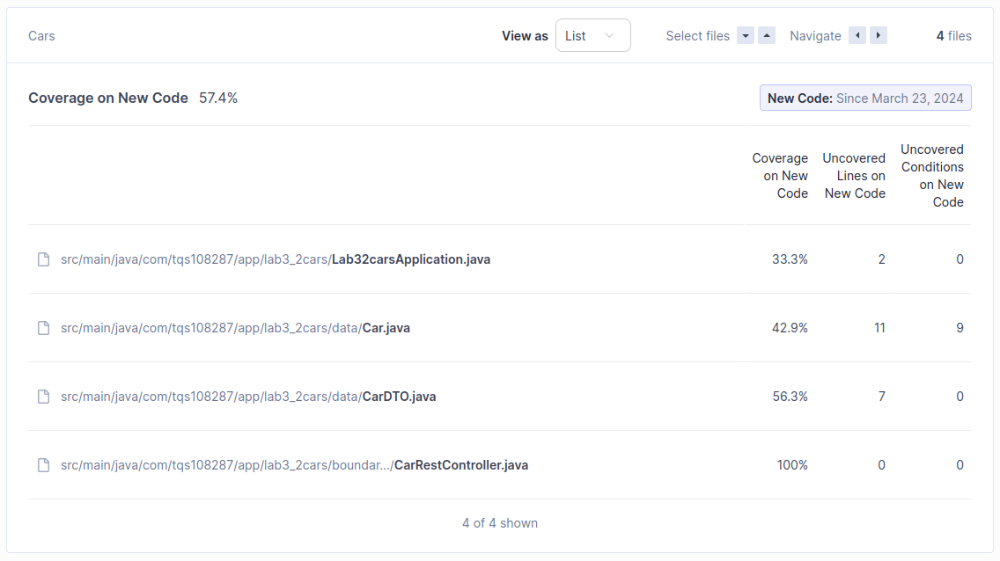

### 6.2.c) Run the static analysis and discuss the coverage values on the SonarQube dashboard (how many lines are “not covered”? And how many conditions? Are the values good?...)
- This was the obtained coverage for the project:

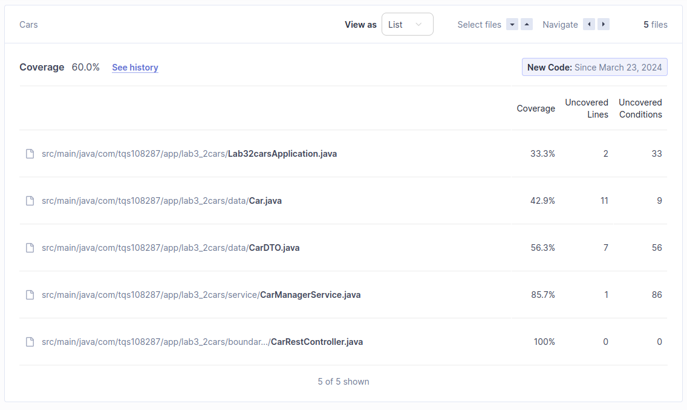

- Despite appearing like a bad number the coverage is not bad in this project because of the following aspects:
  - In Lab32carsApplication.java, we have a coverage of 33.3% related to running the application which we don't need to test.
  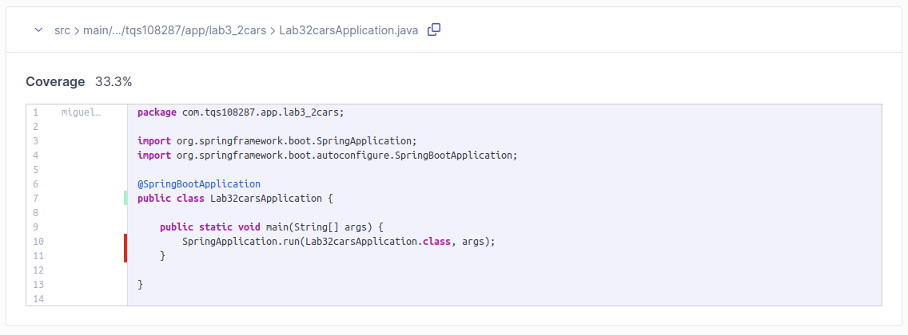
  - In Car.java, we have a coverage of 42.9% related to generated methods like equals, hashcode, setters and toString.
  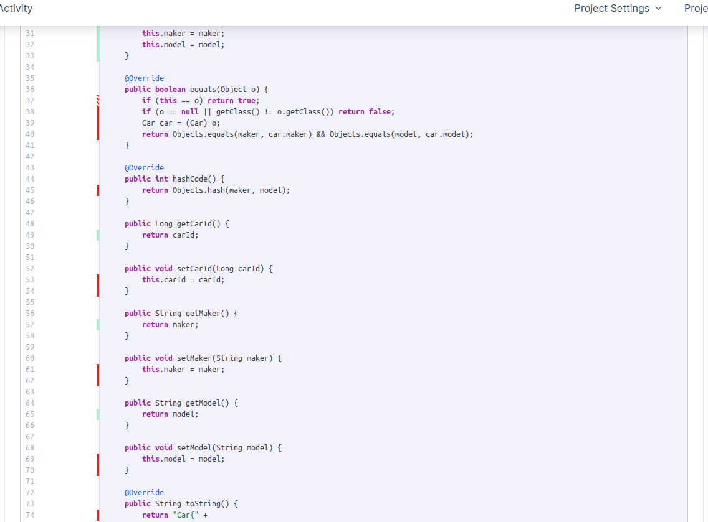
  - In CarDTO.java, we have a coverage of 56.3% related to generated methods like setters. The only important code which hasn't been covered is the fromCarEntity function.
  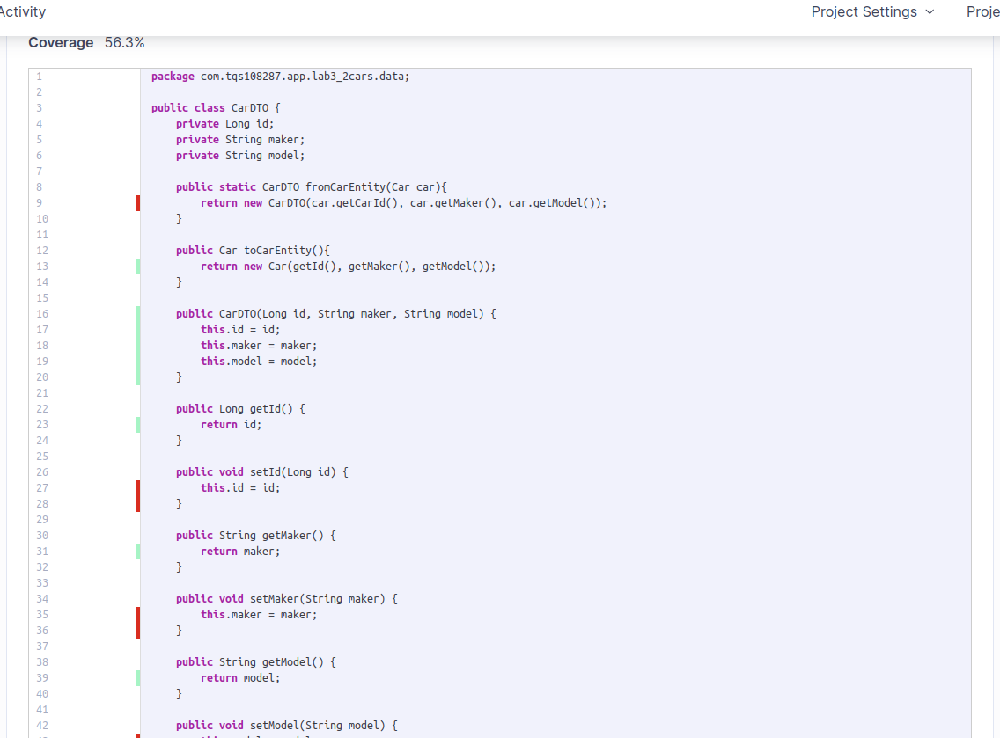
  - In CarManagerService.java, we have a coverage of 85.7% which is good overall despite not having covered save method.
  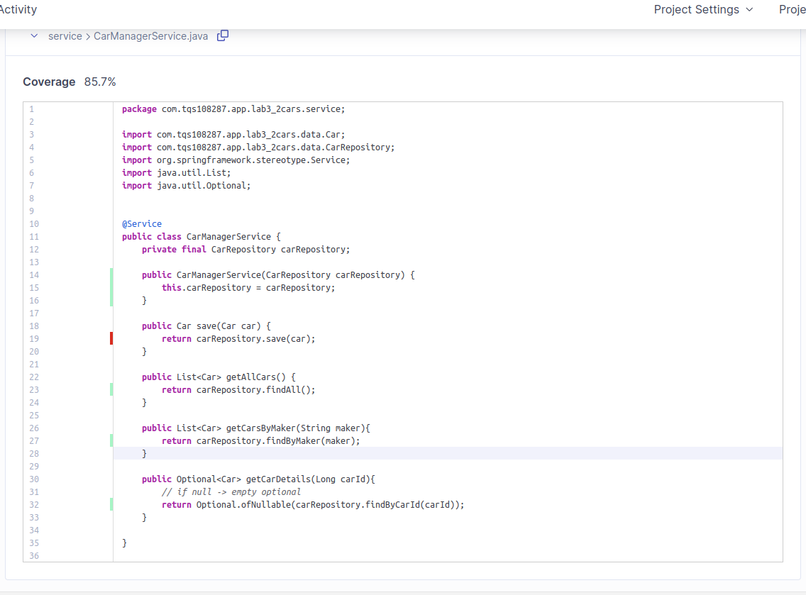
  - In CarRestController.java, we have a coverage of 100% :)
- Conclusion: 
  - Uncovered Lines: 21
  - The results are overall good because of previously mentioned reasons.

### 6.3.a) Define a custom quality gate to this project. Feel free to mix the metrics but explain your chosen configuration.
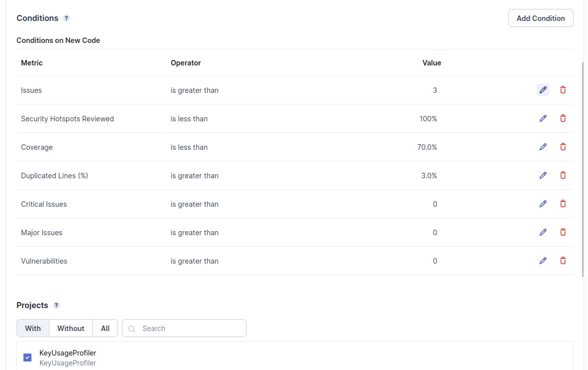
- **Defined Quality Gate**:
  - **Issues is greater than 3** - To allow the existing of some unused import statements
  - **Security Hotspots Reviewed - Default**
  - **Coverage - 70%** because of functions generated by IDE's like hash functions, toString, getters and setters that do not require testing
  - **Duplicated Lines - default**
  - **Critical Issues is greater than 0** & **Major Issues is greater than 0** - required as we allowed the existence of 3 issues because of the previous rule **"Issues is greater than 3"**. However, we don't to allow any critical or major issues like serialization related issues or NullPointerExceptions, respectively.     
  - **Vulnerabilities is greater than 0** as security shouldn't be taken seriously.

### 6.3.b) Add an increment to the source code. You may try to introduce some “bad smells”; in fact, try to break the quality gate.
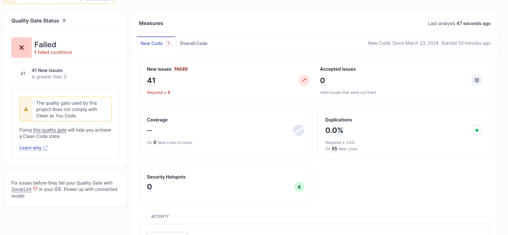
- Added 41 import unused import statements
- As we can see there is a message saying that was required that the number of issues was less than 3 showing that the defined quality gate is being used.  
- We have a coverage of 0.0% as there wasn't any tests in IES course.
- Security Hotspots were 0 complying with the defined security gate. 
---

## UTILS
- Prepare a local instance of SonarQube server
```bash
docker run -d --name sonarqube -e SONAR_ES_BOOTSTRAP_CHECKS_DISABLE=true -p 9000:9000 sonarqube:latest;
```

- Running a SonarQube analysis with Maven is straighforward. You just need to run the following command in your project's folder.
```bash
mvn clean verify sonar:sonar \
  -Dsonar.projectKey=Euromillions \
  -Dsonar.projectName='Euromillions' \
  -Dsonar.host.url=http://localhost:9000 \
  -Dsonar.token=sqp_e8ffe47f036f703ae1e210ca775b05946adb2c84
```

